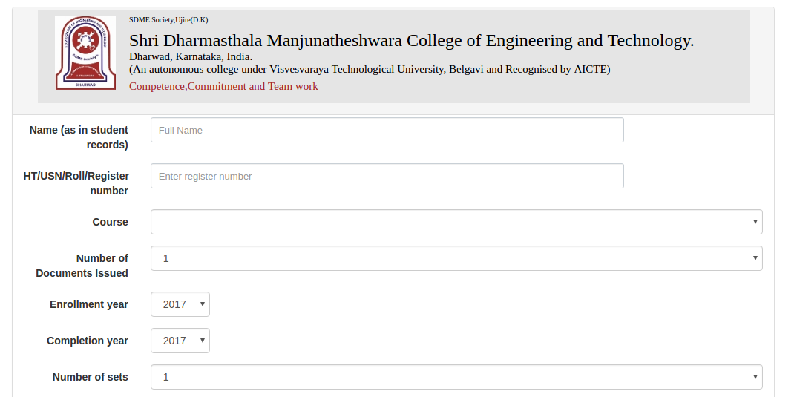
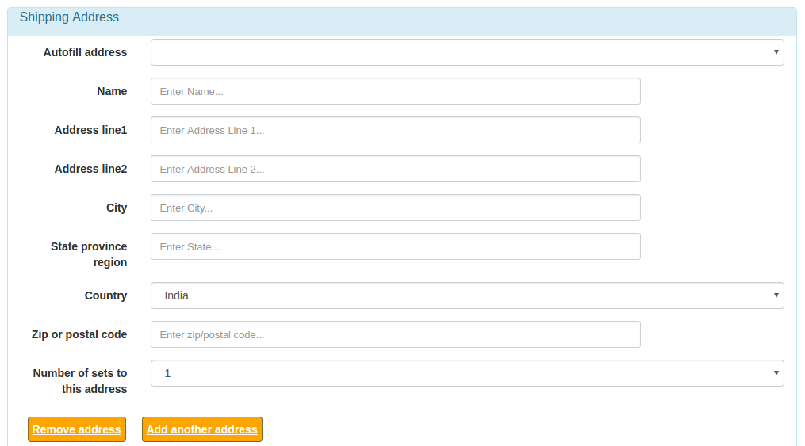
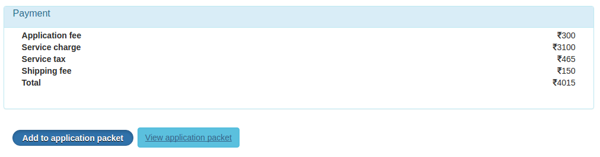

# utms_web
# UTMS Web Frontend
utms_web is a web interface for educational institutions to accept online applications for transcripts and other educational records.

Educational institutions can view and modify the orders through admin screens, however, for more elaborate order management they can use a ERP or UTMS backend software.

UTMS can be easily customized for an educational institution by configuration in the DB. 
Customizations to show custom banner image, pricing formula, form fields can be incorporated. 

Payment gateway integrations built in for CCAvenue, PayPal

Pre-requisites:
- Ruby 2.3.1
- Rails 5.0
- MySQL 5.7

Download the source code here: <a href="https://github.com/jkulkarni/utms_web">https://github.com/jkulkarni/utms_web</a>

Demo Screens:

Developers:
Himanshu Mehta, Jayaprakash Kulkarni

License:
Licensed under the Affero General Public License AGPL v3 (the "License").
You may obtain a copy of the License at

    https://www.gnu.org/licenses/agpl-3.0.html

Unless required by applicable law or agreed to in writing, software
distributed under the License is distributed on an "AS IS" BASIS,
WITHOUT WARRANTIES OR CONDITIONS OF ANY KIND, either express or implied.
See the License for the specific language governing permissions and
limitations under the License.

